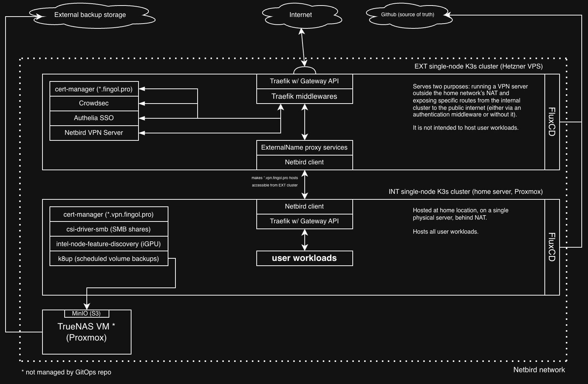

# K3s Homelab IaC



## About

**Hypervisor**: Proxmox VE <br />
**NAS**: TrueNAS VM (ZFS) <br />
**Number of clusters**: 2 <br />
**Number of nodes**: 1 (both clusters) <br />
**K8s distribution**: K3s (both clusters) <br />
**Deployments**: FluxCD <br />
**HA**: none at all ⚰️

This GitOps project is an attempt to switch to an orchestrated and (as much as possible) declarative environment from a bunch of docker-compose files scattered across different VMs.
Given the fact that sky is the limit when it comes to over-engineering that involves Kubernetes, I've decided to limit my expectations to a non-HA setup.
I have only one physical server with good performance, so there were not that many options anyway. The only thing that needs to be rented is an external VPS to host the external cluster with VPN server on it, as I am behind NAT. 

OpenTofu is used for creating resources. Empty resources are then configured from scratch by Ansible playbooks.

The resulting infrastructure is pretty easy to use on a daily basis, it can be destroyed and created just in a few minutes (I should stop doing this). Feel free to take any part of it or use it as a whole.

## Installation

In Mac OS, most of these tools can be installed via homebrew.

### Required CLI tools

kubectl, opentofu, ansible, fluxcd, kustomize, age, sops

### Optional CLI tools

k9s (great for managing on-prem clusters), restic (for maintenance of backup snapshots)

## Deploying from scratch

### Prerequisite

#### DNS

```
You should have two A records:
- vpn.example.com -> 100.116.56.43
- *.vpn.example.com -> 100.116.56.43
```

This IP is a virtual one from Netbird network and will be assigned to the internal cluster's peer later. You are free to set any other.
It's just much quicker to set IP from existing A records in Netbird than the other way around, as there is no need to wait for DNS propagation.

#### cloud-init

OpenTofu's Proxmox provider requires a VM template to exist in Proxmox to create a local node. There is a very simple script that creates a VM template from Debian 13 cloud-init image. Tested it with VE 9.

### Steps

#### OpenTofu

1. Create opentofu/terraform.tfvars and opentofu/persistent/terraform.tfvars from corresponding examples.
2. Run 'tofu apply'. Once everything's done, OpenTofu will create an Ansible inventory called 'inventory.tf.yml' in ansible/ folder

#### Ansible

Run playbooks using 'inventory.tf.yml' inventory in this order:

1. system-utils-install.yml
2. k3s-internal-cluster-install.yml
3. k3s-external-cluster-install.yml
4. crowdsec-add-bouncer.yml (takes care of everything related to Crowdsec)

Once this is taken care of, open Authelia SSO (auth.example.com). Log in with default credentials from the secret.
Authelia will require from you to have TOTP configured. A secret code to confirm TOTP will be created in the authelia's container: /config/notification.txt

In Netbird dashboard (netbird.example.com), create an access token, put it into Ansible's "inventory.tf.yml".

Back to playbooks:

5. netbird-configure.yml

When two clusters are connected, change the internal cluster's (k3s-int) IP to 100.116.56.43 in the dashboard. If there's no connection after that, delete netbird-router pod on int; it will be created again.

That's it. Now you have two clusters in the same Netbird network with FluxCD taking care of reconciliation/deployment.

#### Restore backups

After the initial FluxCD reconciliation, you are free to restore each namespace's state with a playbook:

```
ansible-playbook -i inventory.tf.yml k8up-int-restore-app.yml -e 'namespace=<ns>'
```

## Manual backup

If a backup of a certain namespace needs to be created, without waiting for the schedule, there's an Ansible playbook:

```
ansible-playbook -i inventory.tf.yml k8up-int-backup-app.yml -e 'namespace=<ns>'
```

## Keeping TLS certificates

By default, new certificates will be requested via DNS challenge from Let's Encrypt.
If you re-create the clusters often (e.g. when debugging), it makes sense to store an issued certificate in the repo to avoid hitting pretty strict limits of the issuer (~20 certificates / month).

To backup a certificate (repeat for both clusters):

```
export KUBECONFIG=./.kubeconfig-<internal/external>

kubectl get secret -n traefik-<int/ext> letsencrypt-dns-wildcard-cert -o yaml > flux/cert-secrets/<ext/int>/wildcard-cert.yaml

Remove resourceVersion, uid, creationTimestamp, and managedFields from wildcard-cert.yaml

sops -e -i flux/cert-secrets/<ext/int>/wildcard-cert.yaml
```

cert-manager will use certificates from the repo automatically, instead of requesting the new ones.

## A note on Helm

This repository follows the *Rendered Manifests Pattern*, i.e. all Helm charts are rendered once and kept statically as read-only manifests inside 'flux/apps/base' or 'flux/infrastructure/base'.
In a home environment, it helps me rely less on external sources. If something needs to be modified, Kustomize patches are the solution.
Some applications (esp. user workloads) are defined manually as manifests under 'ext/' or 'int/' and have no 'base/'.

To update a Helm chart, the only thing needed is to run Renderer.sh with a newer version specified:

```
./renderer.sh --chart kubernetes-operator --repo-name netbirdio --repo https://netbirdio.github.io/kubernetes-operator --version 0.1.15 --folder netbird-operator --namespace netbird-operator --is-infrastructure false
```

--is-infrastructure parameter determines in which Flux overlay (apps or infrastructure) the chart is going to be saved to.
To make the update process easier, Renderer.sh creates a comment with timestamp and all input arguments provided when it was executed for the last time.
If there is no such a comment in 'manifest.readonly.yaml', the manifest was created manually from some source, without Helm. In such exceptional cases, I leave a note.

If rendering chart for the first time, create a folder (that you'll specify later with '--folder' parameter). To override default Helm values, create 'values-base.yaml' on the root level of the folder.

## Shared resources

Some resources (e.g. secrets) are not accessible from other namespaces, and using the "default" namespace without a reason is a bad practice.
But there are deployments (e.g. stub-website on ext) that use git-sync init containers to populate their volumes with static data like configuration, webpages, etc.
To avoid duplication of same resources in each namespace where they're needed, there exists a 'flux/shared-resources/' directory.
Each shared resource has its separate directory and can be included in Kustomization.yaml of any app/infrastructure where it is needed.
A copy will be created in the clusterfor each namespace on the reconciliation step.

## Cons/TODOs

- It would be much safer to scale down deployments during k8up's scheduled backup creation. Maybe a custom scheduled Job would do the job.
- Unfortunately, using FluxCD's envsubst to remove repeating domain names from the repo has too many side-effects, primarily because of shell scripts in configmaps that are used in the dependencies.
